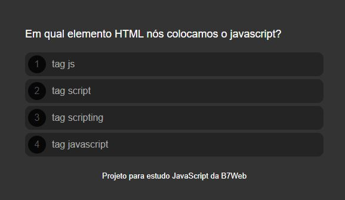

# Projeto-Quiz

<h2>Conecimentos obtidos com o projeto</h2>

<ul>
    <li>Maniulação de Arrey</li>
    <li>Maniulação de Objeto</li>
    <li>Maniulação do DOM</li>
    <li>Condicionais</li>
    <li>Loops</li>
    <li>Funções</li>
    <li>Eventos</li>
</ul>
Projeto costumizavel podendo adicinar mais questões, ajustar as avalições e modificar a interface.

<h2>Captura de tela:</h2>  

